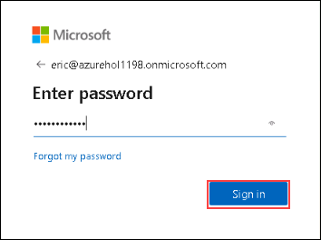
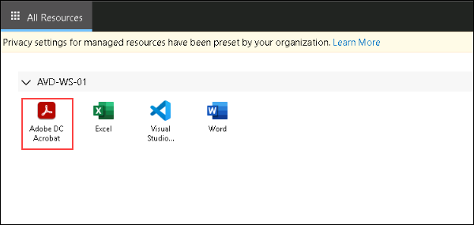
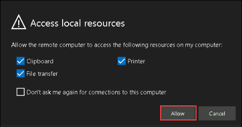
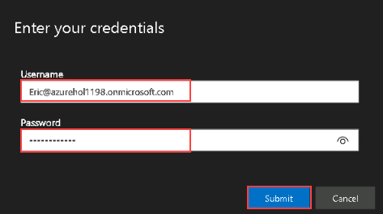

# Access the Published Application in Pooled Hostpool

In this exercise, we will access the Desktop and RemoteApps using browser.

1. Open the following URL in a new browser tab in the JumpVM. This URL will lead us to the Remote Desktop Web Client.

        aka.ms/wvdarmweb

2. Now to login, enter the lab credentials as mentioned below:

   - Username: **<inject key="User 01" />**

   - Password: **<inject key="User Password" />**

   

>**Note:** If there's a dialog box saying Help us protect your account, then select Skip for now option.

3. The AVD dashboard will launch, then click on the application you want to access.

   

4. Select **Allow** on the prompt asking permission to *Access local resources*.

   
   
5. Enter the lab credentials to access the application and click on Submit.

   - Username: **<inject key="User 01" />**

   - Password: **<inject key="User Password" />**

   
   
6. The application will launch and will be ready to use.
